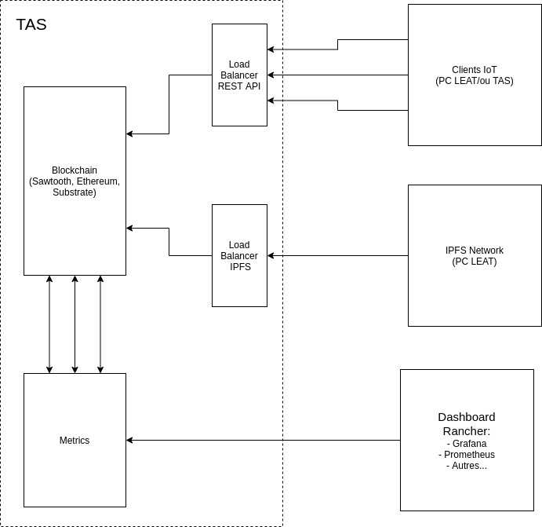

# SIM-TAS-Group-tests
Repo principal contenant tout le nécessaire pour les tests chez TAS Group.

**Important**: Add and change the README.md file in each folder to keep up with installation instruction, requirements and other documentation.

## Issues & evolution of the project

To keep up with the project the issues are used to list and see the progress of the project.

**Note:** The project [dashboard is here](https://github.com/orgs/projet-SIM/projects/1)

## Global test architecture




## Specification of this repo

Documentation on the rest structure of the SIM project in order to do full-scale tests on the TAS Group cloud.

Structure:
```text
--ce repo (repo pour tout les tests de platformes)
	--branch dev (local )
		--module (sawtooth)
		--module (eth, ...)
			--code 2 (luc)
	--branch main (prod)
		--module (sawtooth)
		--module (eth, ...)
			--code 1 (roland)
```
      
## Steps

- [ ] Mettre en forme le code dans le repos pour le deploiement
- [ ] Intergrer le code avec cloud TAS
- [ ] Faire les tests en local
- [ ] Faire les tests chez TAS
